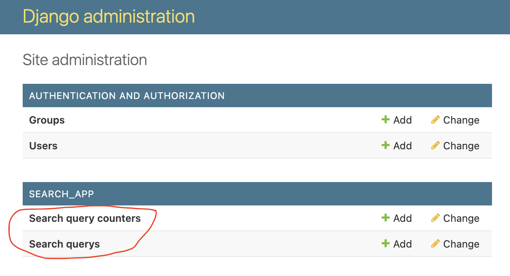

## Intro

This is a Django web application that allows users
to search for restaurants in a city and view their menus and ratings. It uses the Google Places API to get this information.
The app stores user search queries in an SQLite database with fields like IP address, search query, and timestamp.
It also stores the number of times each query was submitted.

By default, the Django web framework comes with an SQLite database and an admin interface where we can view the database
records.

## Setting up the environment and running the app.

#### - Install the required Python dependencies:
Open a terminal in the project's root directory and run:
```
pip install -r requirements.txt  
```
#### - Start the Restaurant Searching app by running:
```
python manage.py runserver
```
Wait for the app to start and start using it.
## Using the Restaurant Search app.

#### - Search for restaurants in a city:
Go to [127.0.0.1:8000/search/](127.0.0.1:8000/search/) or [localhost:8000/search/](localhost:8000/search/)
which is the main page for our restaurants searching functionality.

Enter a city name in the search bar and click search to get the results table of restaurants in that city.

You can notice that it takes some time to retrieve the restaurant results. That is because many Google 
API calls are done in the backend everytime we search for restaurants in a city. This is something that needs to be optimized
and it is explained in the **_Improvements/discussion_** section of this file.

Do a couple of searches. For example search for restaurants in London, Athens, Milano. 
Search for restaurants London three times in  order to see the query counter increased in the admin page. 

## Using the admin page.
In the admin page we can view the records in the app's database.
The database of the app has two tables the SearchQuery and the SearchQueryCounter tables.

Go to [127.0.0.1:8000/admin/](127.0.0.1:8000/admin/) or [localhost:8000/admin/](localhost:8000/admin/).
#### - Sign in:
```
Username: admin 
Password: adminadmin
```
#### - View the search query data and number of times each query was submitted:

Click on the **_Search querys_** to see the submitted queries with the user's IP address 
and timestamp (See image below).

Click on the **_Search query counters_** to see number of times each query was submitted (See image below).



## Improvements/discussion.

1. Add a foreign key from the search_query field of SearchQuery table to the search_query field of the 
SearchQueryCounter table (this can be done through the Django models). While this is a good practise when
we think about Relational Databases in general and the relationships between it's tables, I am not sure that it will
serve our application. 
Moreover, if I make this change I will need to make bigger changes in my Django code as well.
Currently, whenever a search query is added in the SearchQuery table then automatically the counter
is updated in the SearchQueryCounter table using the _signals_ Django library. If I add the foreign key 
constraint it won't be able to add a search query in the SearchQuery table the first time it is made because it won't 
exist in the SearchQueryCounter table and that will break the constraint.
2. We need to use another API for getting the restaurants because currently Google API cannot give us 
city, menus and ratings for restaurants with one API call. That is why we need to first retrieve the restaurants ids 
with one API call and the FOR EACH restaurant id we need to make another API call to retrieve all the info we need. 
It is like a JOIN operation of API calls and it significantly increases the latencey.
3. Add pagination to be able to view more restaurants. We need to use next_page_token field of the Google API response.
Calling the request with the same next_page_token will return the next page of results (this is from the 
[Google Api Documentation](https://developers.google.com/maps/documentation/places/web-service/search-text)).

   